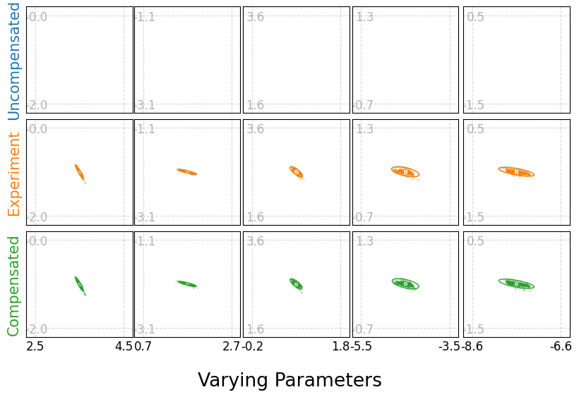

# METRIX Beamline Offset Finding
<a href="https://pytorch.org/get-started/locally/"></a>

An offset finding method based on a deep learning surrogate model and a Genetic Algorithm at the METRIXS beamline at BESSY II, Helmholtz-Zentrum Berlin.

## Offset finding of a simulated real-world beamline


## Quick Start

```py
import torch
from ray_tools.hist_optimizer.hist_optimizer import *
from ray_nn.nn.xy_hist_data_models import *

# Load model
model_path = "outputs/xy_hist/s021yw7n/checkpoints/epoch=235-step=70000000.ckpt"
model = Model(path=model_path)

# Simulate real-world beamline
offsets_selected, uncompensated_parameters_selected, compensated_parameters_selected = find_good_offset_problem(model, fixed_parameters = [8, 14, 20, 21, 27, 28, 34])

with torch.no_grad():
    observed_rays = model(compensated_parameters_selected)

# Find offsets with Genetic Algorithm
loss_min_params, loss, loss_min_list = optimize_evotorch_ga(model, observed_rays, uncompensated_parameters_selected, iterations=1000, num_candidates=500, mutation_scale=0.2, sbx_crossover_rate=0.8, tournament_size=3)
```

## Citation

If you find this useful in your research, please consider citing:

[Offset Finding of Beamline Parameters on the METRIXS Beamline at BESSY II Using Machine Learning.](https://iopscience.iop.org/article/10.1088/1742-6596/3010/1/012130)

    @article{Meier2025,
      doi = {10.1088/1742-6596/3010/1/012130},
      year = {2025},
      month = {5},
      publisher = {IOP Publishing},
      volume = {3010},
      number = {1},
      pages = {012130},
      author = {Meier, David and Zeschke, Thomas and Feuer-Forson, Peter and Sick, Bernhard and Viefhaus, Jens and Hartmann, Gregor},
      title = {Offset Finding of Beamline Parameters on the METRIXS Beamline at BESSY II Using Machine Learning},
      journal = {Journal of Physics: Conference Series},
    }
